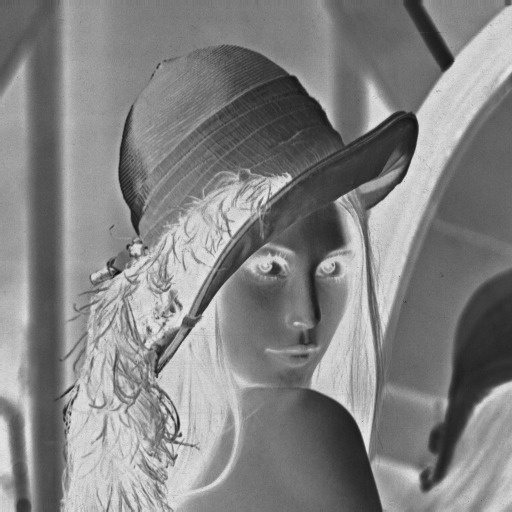

# Exercício 4 — Negativo da Imagem

## Resultados

| Imagem | Descrição |
|--------|-----------|
|  | Imagem original em escala de cinza |
|  | Imagem após a transformação de negativo |

Observa-se que a operação preserva integralmente a estrutura espacial (bordas, texturas e formas permanecem inalteradas), alterando apenas a distribuição de intensidades. Regiões que eram predominantemente claras na imagem original surgem como escuras no negativo, e reciprocamente. A operação é sua própria inversa: aplicando-a duas vezes, recupera-se a imagem original.

