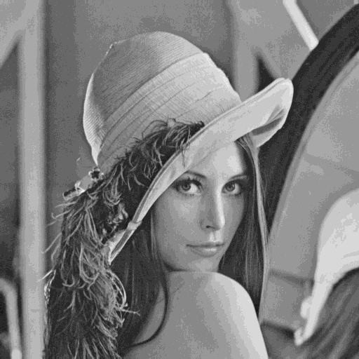

# Exercício 6 — Redução de Níveis de Cinza (Quantização)

## Resultados

| Níveis | Imagem |
|--------|--------|
| 256 (original) |  |
| 128 níveis |  |
| 64 níveis |  |
| 16 níveis |  |
| 4 níveis |  |

## Comparação visual

- **128 níveis**: praticamente indistinguível da original a olho nu. A redução de 256 para 128 níveis remove apenas 1 bit de precisão, e a diferença perceptual é imperceptível na maioria das regiões.

- **64 níveis**: diferença sutil. Em regiões com gradientes suaves (como céus ou sombras), pode-se começar a notar uma leve perda de suavidade nas transições tonais.

- **16 níveis**: surgem **bandas falsas** (*false contouring*) claramente visíveis, especialmente em áreas de gradiente suave. As transições entre níveis adjacentes tornam-se abruptas, criando contornos artificiais que não existiam na imagem original.

- **4 níveis**: a imagem assume aparência de **posterização** extrema, com apenas 4 tons de cinza representando toda a informação. A maior parte dos detalhes tonais é perdida, e a imagem resultante assemelha-se a uma ilustração simplificada.

