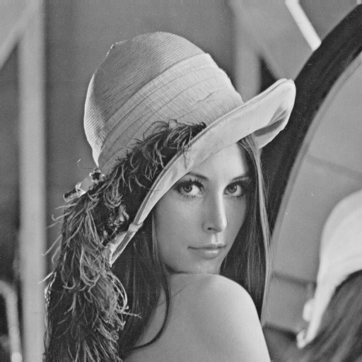
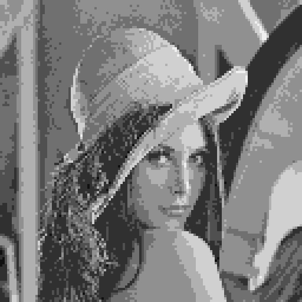

# Exercício 8 — Comparação entre Amostragem e Quantização

## Resultados

| Imagem | Descrição |
|--------|-----------|
|  | Imagem original (512×512, 256 níveis) |
|  | Resolução reduzida por fator 4 |
|  | Quantizada para 8 níveis |
|  | Ambos os efeitos combinados |

## Comparação visual

### Sub-amostragem (resolução ÷ 4)
A imagem apresenta **pixelização** pronunciada: blocos de pixels constantes tornam-se claramente visíveis, bordas ficam serrilhadas e detalhes finos desaparecem. No entanto, as transições de intensidade dentro de cada bloco permanecem suaves — não há "degraus" tonais artificiais. O artefato é exclusivamente **espacial**.

### Quantização (8 níveis)
Todos os detalhes espaciais da imagem original são preservados: bordas, texturas e formas permanecem nítidos. Porém, surgem **bandas falsas** (*false contouring*) nas regiões de gradiente suave, onde os 8 níveis disponíveis são insuficientes para representar transições tonais graduais. O artefato é exclusivamente de **intensidade**.

### Combinação
A imagem sofre degradação nos dois domínios simultaneamente, resultando na **pior qualidade visual**: pixelização evidente (perda espacial) combinada com bandas falsas (perda tonal). Esse resultado confirma que amostragem e quantização são dimensões **independentes** da fidelidade da imagem, e que a degradação em cada uma se acumula de forma aditiva na percepção visual.

## Conclusão

A sub-amostragem e a quantização afetam aspectos ortogonais da representação de uma imagem digital. A primeira limita a capacidade de representar **variações espaciais** (detalhes, bordas), enquanto a segunda limita a capacidade de representar **variações de intensidade** (gradientes suaves, transições tonais). A combinação de ambas as degradações demonstra que uma representação fiel exige resolução adequada tanto no domínio espacial quanto no domínio de intensidade.

